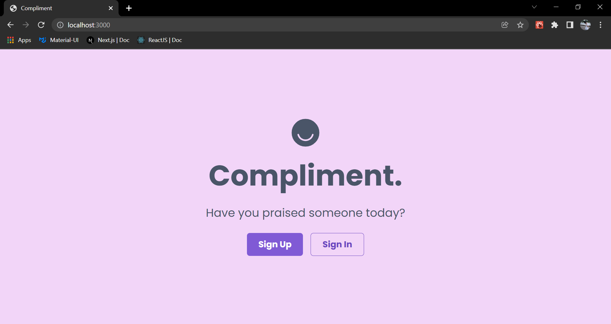
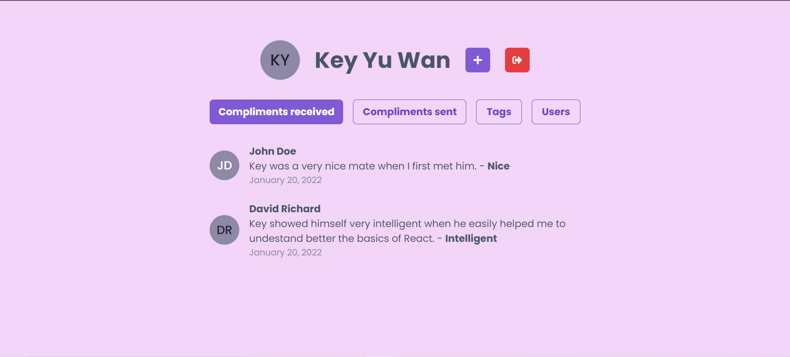
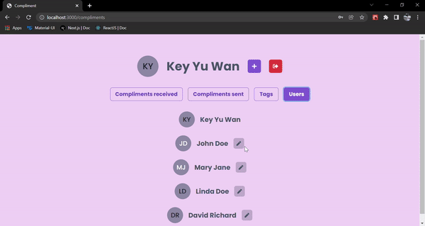

# Compliment - ReactJS

This repository contains the Front-End part of the Project Compliment.

Back-End: <a href="https://github.com/keyyuwan/Compliment-Node.js" target="_blank">Compliment-Node.js</a>
 

# 🎥 Overview

 

# 💻 Project

I developed the back-end part of this project in the NLW event from Rocketseat. And so, I wanted to develop the Front-end to improve even more my Front-End skills.

The idea of the app is to compliment users. You can send compliments to any user, view your received and sent compliments, view the list of users and the list of tags used to categorize the compliments.

It has the functionalities:

- Sign up
- Sign in (authentication)
- Send Compliments
- View Users
- View Tags
- Create Tags (only admin)
- View received compliments
- View sent compliments

The data is consumed from the REST API of the project made with Node.js, Express and TypeORM. (<a href="https://github.com/keyyuwan/Compliment-Node.js" target="_blank">Compliment-Node.js</a>)

The interface was built using Chakra UI.

 

# ⚡ Technologies:

### • ReactJS

### • Next.js

### • Chakra UI

### • Typescript
